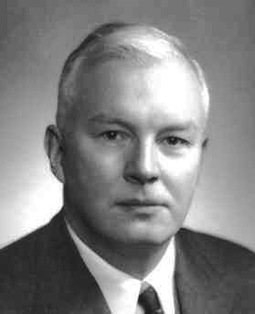
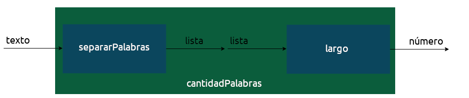

# Programación funcional en JS


===

Comencemos respondiendo a dos preguntas centrales.

**¿Qué es la programación funcional?**

**¿Cómo podemos aplicarla en JavaScript?**

===

## Paradigma funcional

Es una forma de resolver problemas de programación bastante antigua: sus **orígenes** se remontan al 1930, cuando ni siquiera existían las computadoras.

--

Las bases teóricas que luego darían lugar a este paradigma se las debemos a, entre otros, estos dos **matemáticos**:

|||
|--------------|---------------|
| Haskell Curry | Alonzo Church |

===

## JavaScript

Es un lenguaje orientado a objetos que, en principio, nada tiene que ver con el paradigma funcional.

Aún así, aprovechando las **capacidades reflexivas** que tiene y su **versatilidad**, podemos poner en práctica muchas ideas funcionales.

--

Si bien no es 100% necesario, en este taller vamos a utilizar una biblioteca llamada [**Ramda**](https://ramdajs.com/), que nos facilita algunas tareas _funcionaloides_.


Todas las funciones que utilizaremos en los ejemplos vienen de esta biblioteca.

===

En este paradigma, tenemos solamente dos cosas: **valores** y **funciones***. 

<small>* ...que a la vez son valores, pero eso lo vemos en un rato.</small>

--

Según esta afirmación, no contamos con:
* **bucles o estructuras de repetición** (`for`, `foreach`, `while`, ni nada de eso),
* **estructuras de control** (bueno, sí hay `if` pero solamente como expresión).

===

## Valores

Son los que conocemos de _toda la vida_: números, booleanos, strings, listas, objetos*, etc.

```js
const anioActual = 2021
const proyecto = 'El Sur también programa'
const edades = [18, 32, 7, 55]
const inscripcion = { 
  dni: 11223344, 
  nombre: 'Pepita', 
  apellido: 'Cosme' 
}
```

<small>*aunque si nos ponemos puristas, estos objetos serían más bien **registros**: solo pueden contener datos, no métodos.</small>

--

Pero con una gran diferencia: todos los valores son **inmutables**.

--

<!-- .slide: data-background-image="img/headblow.gif" -->
<!-- .element: style="color: white" -->
Es decir, que una vez creados 

<h2 style="color: #ffc56c">no se pueden modificar</h2>
nunca más.


===

## Funciones

Las pensamos _casi_ en un sentido matemático: ante una misma entrada obtendremos siempre la misma salida.


--

Esta forma de concebir a las funciones implica que, en este paradigma, **no son posibles las mutaciones**. 

O, en criollo, no existe la idea de variable como la concebimos en otros paradigmas.

```js
// Esto no se puede hacer...
var x = 10
x = x + 8
```

--

Veamos algunos ejemplos...

> Definir una función que reciba un número y devuelva el siguiente. <!-- .element: class="fragment" -->

 <!-- .element: class="fragment" -->

```js
// Durante el taller utilizaremos esta sintaxis, 
// aunque bien podría usarse la tradicional function
const siguiente = (numero) => numero + 1

siguiente(3)
// 4
siguiente(-200)
// -199
``` 
<!-- .element: class="fragment" -->

--

> Definir una función que reciba un texto e indique si tiene espacios. <!-- .element: class="fragment" -->

 <!-- .element: class="fragment" -->

```js
// La función includes es de Ramda
const tieneEspacios = (texto) => includes(" ", texto)

tieneEspacios('Hola qué tal')
// true
tieneEspacios('sinrepetirysinsoplar')
// false
``` 
<!-- .element: class="fragment" -->

--

> Definir una función que reciba dos listas y devuelva a la que tiene más elementos. <!-- .element: class="fragment" -->

 <!-- .element: class="fragment" -->

```js
const laMasLarga = (lista1, lista2) => 
  length(lista1) > length(lista2) ? lista1 : lista2

laMasLarga(['hola', 'chau'], [10, 7, 8, 3])
// [10, 7, 8, 3]
laMasLarga([true, false, true], [])
// [true, false, true]
``` 
<!-- .element: class="fragment" -->

===

## 🦾 Manos a la obra

Entrá a https://bit.ly/funcionalmumuki y resolvé el primer ejercicio.

☝️ Cuando termines, **no cierres la página**. Vamos a seguir trabajando ahí.

[📊 Ver estadísticas](https://mumubi.ikumi.online/superset/dashboard/16/)

===

## Las funciones son valores

Como adelantamos hace un rato, las funciones en este paradigma son valores como cualquier otro. 

Eso significa que podemos **pasarlas por parámetro** y escribir **funciones que devuelvan funciones**. 😲

--

A las funciones que reciben y/o devuelven funciones se las suele conocer como de **orden superior**. 

Este tipo de funciones nos permite eliminar **código repetido** y elevar el nivel de nuestras soluciones: en vez de pensar en _cómo_ lo hacemos, podemos concentrarnos en _qué_ queremos hacer.

--

Veamos un típico ejemplo que suele llevarnos a repetir código: filtrar una lista.

```js [1-8|4]
function soloPares(lista) {
  const resultado = []
  for (const elemento in lista) {
    if (esPar(elemento)) {
      resultado.push(elemento)
    }
  }
  return resultado
}
```

```js [1-8|4]
function menoresA5(lista) {
  const resultado = []
  for (const elemento in lista) {
    if (elemento < 5) {
      resultado.push(elemento)
    }
  }
  return resultado
}
```

--

¿Qué pasaría si, en vez de repetir siempre la misma estructura, creamos una función que sepa cómo filtrar una lista?

```js
function filter(condicion, lista) {
  const resultado = []
  for (const elemento in lista) {
    if (condicion(elemento)) {
      resultado.push(elemento)
    }
  }
  return resultado
}
```

Como se ve, deberíamos pasarle dos cosas: la **función** que filtra, y la **lista** que queremos filtrar.

--

Con nuestra nueva herramienta, filtrar una lista se vuelve una tarea de una línea de código. 😎

```js
const esPar = (x) => x % 2 == 0

// Podemos pasarle una función ya definida...
const soloPares = (lista) => filter(esPar, lista)

// ...o definir una "en el momento".
const menoresA5 = (lista) => 
  filter((x) => x < 5, lista)
```

--

**Operaciones típicas sobre listas, que ya vienen implementadas en Ramda:**

* `map(funcion, lista)` - devuelve la lista que resulta de aplicar la función a cada elemento.
* `filter(condicion, lista)` - devuelve la lista con los elementos que cumplen la condición.
* `find(condicion, lista)` - devuelve el primer elemento que cumple la condición.
* `maxBy(funcion, lista)` - devuelve el mayor elemento según la función dada.

===

## 🦾 Manos a la obra
Volvé a https://mumuki.io/surprograma y resolvé el **segundo** ejercicio.


[📊 Ver estadísticas](https://mumubi.ikumi.online/superset/dashboard/16/)

===

## Composición

Como dijimos, también es posible crear funciones que **devuelvan funciones**.

En particular, hay una herramienta muy poderosa que nos permite combinar dos funciones. O **componerlas**, como le diríamos en matemática.

--

Supongamos que queremos definir una función para contar las palabras de un texto.

```js [4-6|8-9]
const largo = (lista) => length(lista)
const separarPalabras = (texto) => split(' ', texto)

// Podemos definirla de manera "tradicional"...
const cantidadPalabras = 
  (texto) => largo(separarPalabras(texto))

// O podemos definirla como una composición de funciones :)
const cantidadPalabras = compose(largo, separarPalabras)
```

--



Para que las funciones _enganchen_, el **tipo de salida** de una tiene que coincidir con el **tipo de entrada** de la siguiente. 

Además, solo podemos componer funciones que tengan exactamente **un parámetro**.

--

Esta posibilidad de crear funciones dinámicamente nos abre un mundo nuevo. 

Por ejemplo, en Ramda hay equivalentes _de alto orden_ de los operadores lógicos:

```js
// Devuelve verdadero cuando ambas lo son (AND)
const puedeVotar = both(esMayorDe16, figuraEnPadron)

// Devuelve verdadero cuando alguna lo es (OR)
const esUnBuenPlato = either(tengoHambre, esRico)

// Devuelve verdadero cuando la original da falso (NOT)
const esImpar = complement(esPar)
```

===

## 🦾 Manos a la obra

Volvé a https://mumuki.io/surprograma y resolvé el **tercer** y el **cuarto** ejercicio.

[📊 Ver estadísticas](https://mumubi.ikumi.online/superset/dashboard/16/)

===

La composición tiene una limitación importante: solo podemos componer funciones que tengan exactamente **un parámetro**.

Pero de nuevo, el paradigma funcional tiene una herramienta para esto, la **currificación**. 😏

--


 <!-- .element: height="200px" -->

Mejor, vamos con un ejemplo 😆 <!-- .element: class="fragment" -->

--

## Currificación y aplicacion parcial

La currificación nos permite crear funciones "intermedias". Esto se logra **aplicando parcialmente** la función, pasandole menos parámetros.

```js
// Definición de una función currificada
const nombreConTitulo = curry(
  (titulo, nombre, apellido) => 
    `${titulo}. ${nombre} ${apellido}`
)

// Fijamos el primer parámetro, se crea una nueva función
// con los dos parámetros restantes libres
const profesoraLlamada = nombreConTitulo('Prof')

// Fijamos los dos primeros parámetros, se crea una nueva 
// función con el parámetro restante libre
const seniorJuan = nombreConTitulo('Sr', 'Juan')
```

--

Luego, podemos utilizar esas funciones normalmente:

```js
nombreConTitulo('Dr', 'Alí', 'Vefá')
// Dr. Alí Vefá
nombreConTitulo('Dra', 'Nazli', 'Gülengül')
// Dra. Nazli Gülengül
profesoraLlamada('Andrea', 'Bueno')
// Prof. Andrea Bueno
profesoraLlamada('Federico', 'Aloi')
// Prof. Federico Aloi
seniorJuan('Quintero')
// Sr. Juan Quintero
seniorJuan('López')
// Sr. Juan López
```

--

Todas las funciones de Ramda vienen currificadas, y por lo tanto podemos aplicarlas parcialmente. 

Y ahí se despliega toda la magia funcional. 🧙‍♂️🧙‍♀️

```js
// Queremos hacer una función que devuelva los nombres de los 
// 3 estudiantes más jóvenes que sepan programación funcional.

const estudiantes = [
  { nombre: 'Fermín', edad: 23, 
    talleresAprobados: ['docker', 'funcional'] },
  { nombre: 'Mara', edad: 19, talleresAprobados: [] },
  { nombre: 'Lara', edad: 55, talleresAprobados: ['docker'] },
  { nombre: 'Arawi', edad: 18, 
    talleresAprobados: ['funcional'] },
  { nombre: 'Nahuel', edad: 31, 
    talleresAprobados: ['git', 'objetos'] },
  // ...más estudiantes...
]
```

--

Podemos pensarla en pasos: **filtrar** la lista de estudiantes, **ordenarla** por edad, **tomar** los primeros 3 y **transformarlos** en sus nombres.

```js [6-12|1-15]
const sabeFuncional = compose(
  includes('funcional'), 
  prop('talleresAprobados')
)

const top3Estudiantes =
  compose(
    map(prop('nombre')),
    take(3),
    sortBy(estudiante => estudiante.edad),
    filter(sabeFuncional)
  )

top3Estudiantes(estudiantes)
// ['Fermín', 'Sandra', 'Arawi']
```

===

## 🦾 Manos a la obra

Volvé a https://mumuki.io/surprograma y resolvé el **último** ejercicio.

[📊 Ver estadísticas](https://mumubi.ikumi.online/superset/dashboard/16/)

===

## ¿Cómo se usa esto en la vida _real_?

Depende el tipo de aplicación, los conocimientos del equipo, las posibilidades de la tecnología y un largo etcétera, se puede utilizar de diferentes maneras.

Puede usarse de manera **pura** o en **combinación con otros paradigmas**, como objetos*. 

<small>* Hoy en día, la mayoría de los lenguajes de objetos soporta, al menos, las operaciones de orden superior sobre colecciones.</small>

--

La inmutabilidad permite dos cosas que en un sistema mutable no serían tan sencillas: 
* **diferir la evaluación** hasta el momento que sea necesario contar con el valor _(lazy evaluation)_,
* **memorizar** resultados en caché, ahorrando así volver a calcularlos.

--

Estas características lo hacen especialmente interesante para sistemas que manipulan **grandes volúmenes de datos**. 📈

También viene pisando fuerte en la construcción de **interfaces de usuario**, disfrazada bajo el nombre cool _functional reactive programming (FRP)_. 🙄

--

Más allá de todo esto, ver las cosas desde otro paradigma nos ayuda a **poner en perspectiva** lo que sabíamos hasta ahora.

Después de pasar un tiempo programando en funcional, ya no van a mirar con tanto cariño a las variables... 😅

===

# ¿Preguntas?

<div class="red-social">
  <i class="fab fa-youtube color"></i>
  <span><a href="https://youtube.com/c/elsurtambienprograma">El Sur también programa</a></span>
</div>
<div class="red-social">
  <i class="fab fa-telegram-plane color"></i>
  <span><a href="https://t.me/surprograma">@surprograma<a></span>
</div>
<div class="red-social">
  <i class="fab fa-instagram color"></i>
  <span><a href="https://instagr.am/surprograma">@surprograma<a></span>
</div>


--

<div style='position: relative; padding-bottom: 56.25%; padding-top: 35px; height: 0; overflow: hidden;'><iframe sandbox='allow-scripts allow-same-origin allow-presentation' allowfullscreen='true' allowtransparency='true' frameborder='0' height='315' src='https://www.mentimeter.com/embed/618f5c99900d4c938318552939b4b1d5/646877580703' style='position: absolute; top: 0; left: 0; width: 100%; height: 100%;' width='420'></iframe></div>
